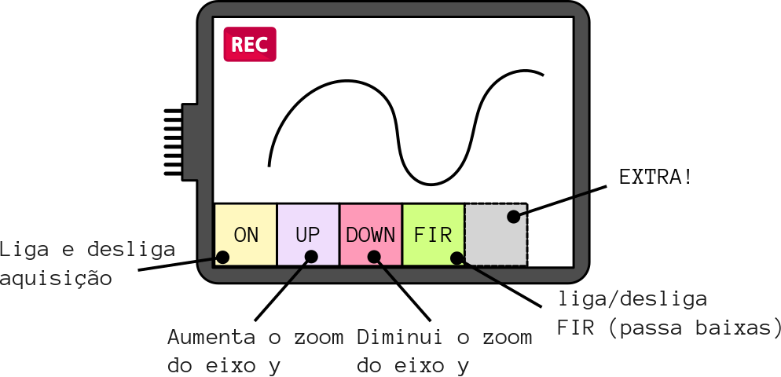

# 2020a - Avaliação prática 2 - Simulado

Nessa avaliação iremos trabalhar com o módulo OLED1 (botões/ LEDs e Display), o mesmo já está disponível no repositório da avaliação. 

- Atualize o arquivo `ALUNO.json` com seu nome e e-mail e faça um commit imediatamente.

>  Faça o seu trabalho de maneira ética!

- **A cada 30 minutos você deverá fazer um commit no seu código!**
    - Códigos que não tiverem commit a cada 30min ou que mudarem drasticamente entre os commits serão descartados (conceito I) !!
    - Você deve inserir mensagens condizentes nos commits!
- Duração: 3h

:triangular_flag_on_post: **Ao finalizar a entrega preencher o formulário (uma única vez!): FORMULÁRIO**

## Descrição

Nessa avaliação iremos trabalhar com o LCD max Touch e iremos desenvolver um osciloscópio digital. Para isso vocês devem usar como base o LAB 9 - FIR.

### Detalhes do display

## Rubricas

Vocês devem gravar um vídeo do firmware funcionando na placa para submeter o projeto.

### C

- Exibe a aquisição ADC no display
- Possui os seguintes botões:
  - ON/OFF: Liga e desliga a aquisição 
  - UP: Aumenta a escala vertical do gráfico
  - DOWN: Diminui a escala vertical do gráfico
  - FIR: Liga e desliga a filtragem do dado
- Quando aquisição estiver ativada, exibir o icone de `REC`:
  - 

### Extras

- Adiciona texto nos botões
- Os botões mudam de cor quando Ligado/Desligado
- Adiciona um botão (Extra) ao lado do FIR que muda a escala do eixo X
- Adiciona um botão que aplica um filtro PASSA ALTAS (fp = 5Hz)
